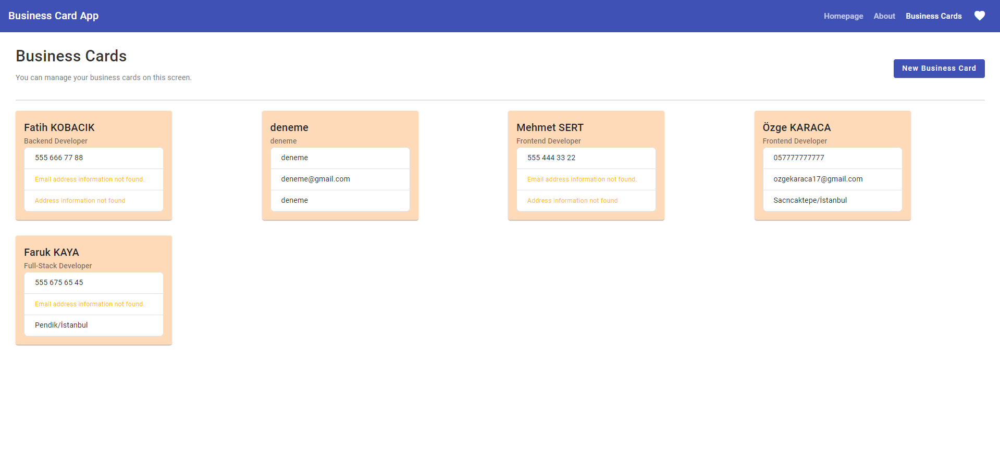
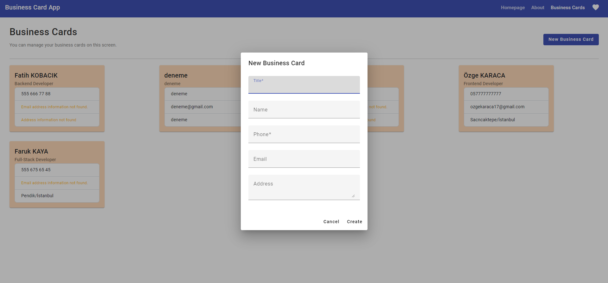

# BusinessCardApp

This project was generated with [Angular CLI](https://github.com/angular/angular-cli) version 16.2.2.

## Development server

Run `ng serve` for a dev server. Navigate to `http://localhost:4200/`. The application will automatically reload if you change any of the source files.

# Angular

Angular material was used.

Retrieving business card information and adding new business cards using the get method via a mock API

#

  
# Images

## Further help

To get more help on the Angular CLI use `ng help` or go check out the [Angular CLI Overview and Command Reference](https://angular.io/cli) page.
